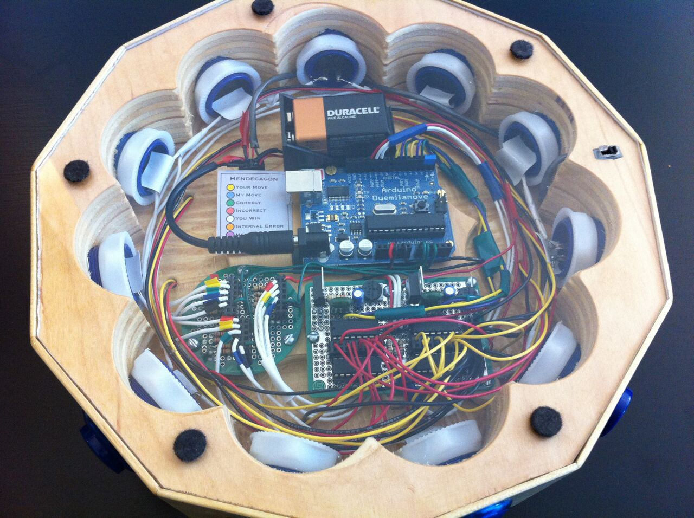
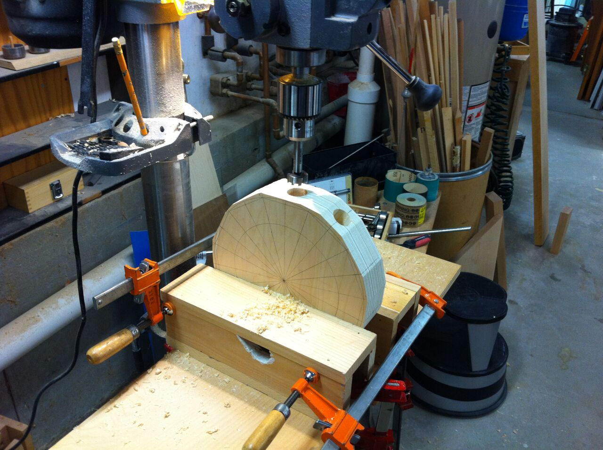
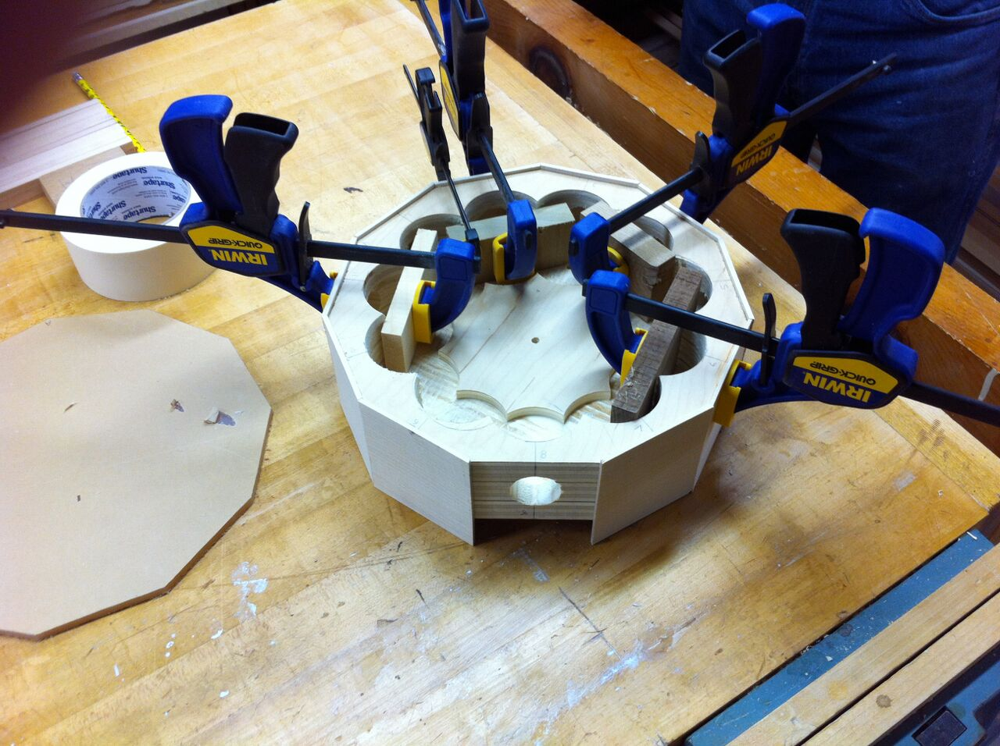
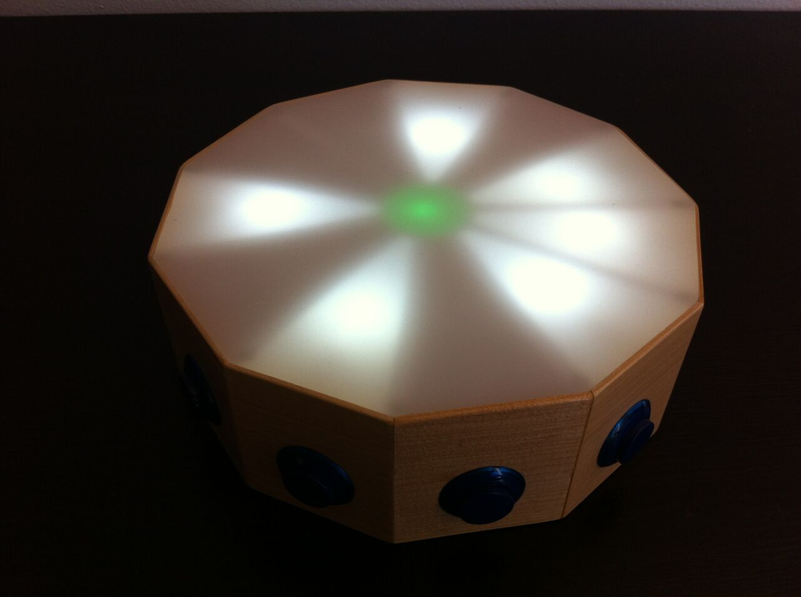
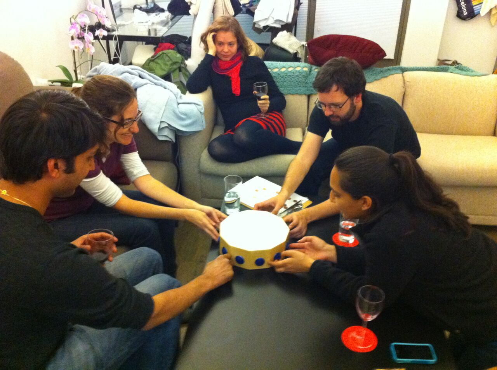
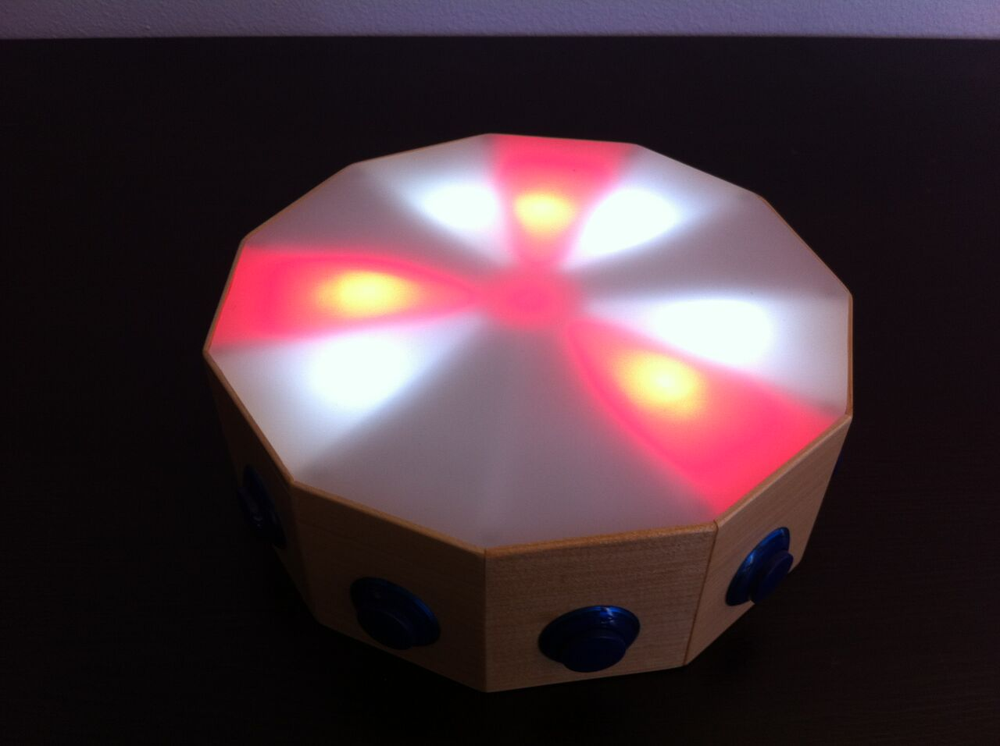
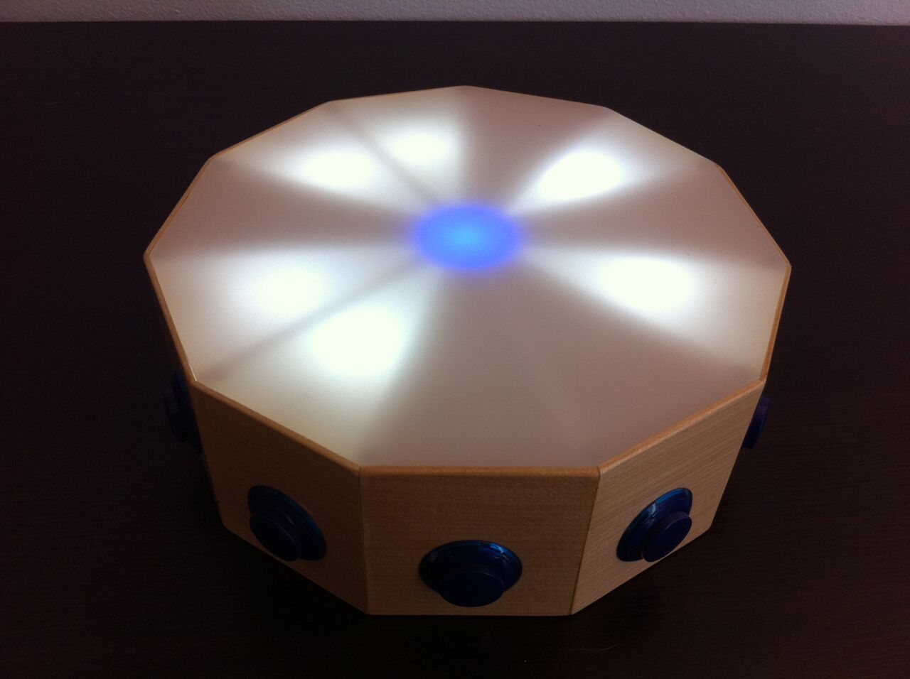
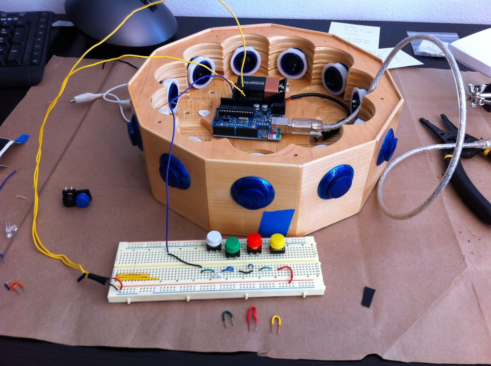

# Hendecagon
An Intricate Electronic Puzzle

The Hendecagon is a physical puzzle about the size of a pie, with 11 buttons that light up 11 pie-sliced wedges. Players can play 11 distinct games, some against a computer player, and some by themselves. Progress is tracked on a main menu which lights up segment by segment as the games are beaten.

## Design
This is meant to be a context-free puzzle, one that can be handed to someone wihout instruction or explanation and played as an explorative experience. This goal influenced the design in a number of ways.

In hardware, the wooden frame had to look as simple as possible. Any markings or patterns could be misinterpreted as significant, distracting players from the game. They would also give reference points that would make the puzzle easier; just as the backs of playing cards need to be indistinguishable, so too do the 11 sides of the puzzle.

In software, each game needs to identify itself and convey its rules in as simple a manner as possible; any superfluous animation or flourish distracts and risks misleading the player. I applied a standard language of interaction prompts across games, where a yellow light is always a prompt for user input, a green light the response for a correct answer, red for incorrect, etc. When the player does something wrong, the incorrect answer is highlighted in red, then the correct answer is shown before returning to the game.

Adjusting difficulty of games was difficult. A puzzle is fun if it requires creativity and ingenuity; it can't reward random guessing. Each game needed to be complicated enough that it couldn't be solved with a lucky guess, but simple enough that it could be learned. Especially difficult to create were the rules for two player games (player vs computer). I wrote a number of scripts to analyze the structure of games, tuning the rules to avoid games of unbounded length, capricious rules, or infrequent reinforcement of key ideas.

The puzzle can be played alone, but is primarily meant to be played socially with a group of people. Several puzzles are structured to be hard alone and easy with multiple people, giving an incentive for cooperation and inclusion. In play testing games took between 10 minutes and 4 hours to solve, and all 11 games were first solved by a group of five players in May 2012.

## Code

The code is split into two parts:

### Analysis (Ruby)

[These scripts](ruby) analyze structure and feasibility of games and produce AI strategies for human-vs-computer matches. With unit tests and a detailed description of each script in the README.

### Microcode (C++)
[Arduino code](arduino/Hendecagon) that runs on the microcontroller as the game is played. Optimized for simplicity and space. The chip has only 2kB SRAM available for variables/working state- that's less space than 13 SMS messages.

## Links

- [Extended Photo Gallery](https://www.facebook.com/media/set/?set=a.734687044118.2189472.701314) with commentary.
- [This same writeup](http://m.atthe.ws/portfolio/hendecagon), published on my web portfolio.

